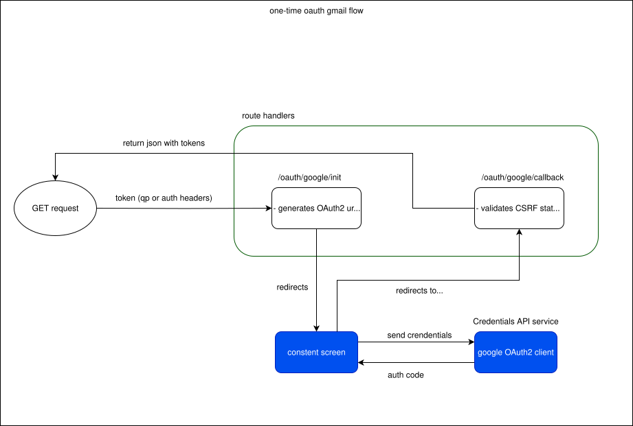

# Teleférico Bariloche 2024 — Web (Next.js)

Aplicación frontend del proyecto, implementada con Next.js (App Router).

- Overview del monorepo: [../README.md](../README.md)
- Infraestructura, CI/CD y despliegues GCP: [../docs/INFRA.md](../docs/INFRA.md)
- Este README: scripts, variables y flujos propios del frontend

## Scripts útiles

- `pnpm run dev`: Ejecuta el servidor de desarrollo en `http://localhost:3000`
- `pnpm run build`: Compila la app
- `pnpm start`: Inicia la app compilada
- `pnpm run lint`: Lintea los archivos
- `pnpm run typecheck`: Chequea que los archivos incluidos en el `tsconfig.json` cumplan con las reglas de typescript

## Variables de entorno

El archivo `.env.example` documenta cada variable de entorno del paquete.

---

## Flujos

### Gmail OAuth setup (Gmail API via OAuth2)

Este proyecto puede enviar correos desde el formulario de contacto usando Gmail API. Para ello se realiza una autorización de una sola vez para obtener un `refresh_token` que luego se guarda como variable de entorno.

Rutas (Next.js App Router):

- `GET /api/oauth/google/init`: genera la URL de consentimiento y redirige. Protegida con token admin.
- `GET /api/oauth/google/callback`: callback de Google, intercambia el `code` por tokens y devuelve el `access_token` y el `refresh_token`.

Flujo:

1. Un admin ejecuta `/api/oauth/google/init` con el encabezado `Authorization: Bearer <INIT_TOKEN>` o el query parameter `?token=<INIT_TOKEN>`.
2. Se abre la pantalla de consentimiento con `access_type=offline` y `prompt=consent` para obtener un `code`.
3. Google redirige a `/api/oauth/google/callback?code=...&state=...`.
4. Si es exitoso, la respuesta JSON muestra los valores `refresh_token`, `access_token` y `expiry_date`. Copiarlo a las variables de entorno `OAUTH_REFRESH_TOKEN`, `OAUTH_ACCESS_TOKEN` y `OAUTH_TOKEN_EXPIRY_DATE` respectivamente (no commitear).



Notas de seguridad:

- El scope está limitado a `https://www.googleapis.com/auth/gmail.send`.
- Se usa `state` firmado (HMAC) y cookie httpOnly para evitar CSRF en el flujo OAuth.
- El endpoint `init` requiere `INIT_TOKEN` para evitar uso público.

Decisión operativa por entornos:

- Actualmente `staging` y `production` comparten la misma integración externa para Gmail OAuth y reCAPTCHA.
- Por esa razón, los siguientes secretos pueden tener el mismo valor en ambos entornos:
  - `RECAPTCHA_SECRET_KEY`
  - `GOOGLE_CLIENT_ID`
  - `GOOGLE_CLIENT_SECRET`
  - `OAUTH_REFRESH_TOKEN`
- Esto es válido si ambos entornos usan la misma cuenta Gmail autenticada, el mismo OAuth Client de Google y la misma configuración de reCAPTCHA.
- Tradeoff: simplifica la operación, pero reduce el aislamiento entre `staging` y `production`.
- Aun compartiendo esos valores, el cliente OAuth de Google debe tener autorizados los redirect URIs de ambos entornos.

Middleware/i18n:

- La `middleware.ts` ya excluye rutas bajo `/api` en su `matcher`, por lo que `/api/oauth/*` no será afectado por redirecciones de locales.

Cómo ejecutar la autorización una vez:

1. Levantar la app (`pnpm run dev`).
2. Abrir: `curl -i -H "Authorization: Bearer $INIT_TOKEN" http://localhost:3000/api/oauth/google/init`
3. Completar el consentimiento en Google.
4. En la redirección a `/api/oauth/google/callback` se devuelve el `refresh_token` (si es la primera vez o con `prompt=consent`).
5. Copiar `refresh_token` y `access_token`:
   - Para desarrollo local pegar los valores en `.env.local`.

Si Google no devuelve `refresh_token`:

- Asegurarse de usar `prompt=consent` y que no haya un otorgamiento previo. Revocar acceso en la cuenta de Google y reintentar.

---

## Arquitectura de seguridad de endpoints y formularios

A continuación se describe cómo está diseñada la **arquitectura de seguridad** alrededor de:

- los formularios públicos (como contacto y postulaciones),
- el **API Proxy** hacia Strapi,
- y los **endpoints administrativos** consumidos desde el dashboard.

El objetivo es entender:

- Qué tipos de endpoints existen.
- Qué problemas intenta resolver cada capa (orígenes externos, abuso de formularios, CSRF, consumo indebido de endpoints internos, etc.).
- Cómo se combinan: origen, API key interna, sesión Auth.js, CSRF token, rate limit, honeypot, validaciones, proxy, etc.

### Tipos de endpoints y modelo de seguridad

A nivel conceptual, el backend de Next.js expone cuatro grandes tipos de endpoints:

1. **Endpoints públicos read-only (public endpoints)**

Rutas:

- `GET /api/proxy/[...endpoint]` (cuando se usa solo para lectura).
- `GET /api/proxy-files/[...endpoint]` (cuando se usa solo para lectura).

Características:

- Accesibles públicamente.
- Solo realizan operaciones de lectura (GET).
- No modifican estado en Strapi ni en otros servicios.
- Se usan para alimentar la parte institucional.

Capas de seguridad principales:

- `ensureTrustedOrigin` para limitar requests desde navegadores a orígenes confiables.
- Rate limit suave para evitar abuso/scraping excesivo.
- No requieren sesión ni API key interna.

2. **Endpoints internos server-to-server (server endpoints)**

   Rutas:
   - `/api/contact`
   - `/api/postulations`
   - Otros endpoints internos que solo deberían ser llamados por Server Actions / servicios internos.

   Características:
   - No se consumen directamente desde el navegador.
   - El frontend público dispara **Server Actions**, que a su vez llaman estos endpoints desde el servidor.
   - Usan una **API key interna** (`x-internal-api-key`) que nunca se expone al cliente.

   Capas de seguridad principales:
   - `requireInternalApiKey(req)`:
     - Verifica que el header `x-internal-api-key` coincida con la variable de entorno `INTERNAL_API_KEY`.
     - Garantiza que solo el propio backend (Server Actions/servicios) pueda invocar el endpoint.

   - `ensureTrustedOrigin` (como defensa adicional para requests que vienen de navegador o se reutilicen patrones).
   - Rate limit agresivo por IP.
   - Límite de tamaño de body (para evitar payloads enormes).
   - Honeypot, edad mínima/máxima del formulario.
   - Validación de esquema (Yup).
   - reCAPTCHA verificado del lado servidor.

3. **Endpoints administrativos (admin endpoints)**

   Rutas:
   - `/api/admin/postulations/[id]/favorite`
   - `/api/admin/postulations/bulk-status`
   - Cualquier endpoint que opere sobre la parte administrativa `/api/admin/*` y se consuma exclusivamente desde el dashboard.

   Características:
   - Solo accesibles para usuarios autenticados en el dashboard.
   - Exponen potencialmente operaciones **CRUD**. Actualmente los endpoint definidos solo operan con el permiso `update` de la interfaz de roles de Strapi.
   - Se consumen desde el cliente del dashboard, pero siempre con sesión Auth.js y un CSRF token.

   Capas de seguridad principales:
   - **Sesión Auth.js (`auth()`)**:
     - Verificación de que el usuario tenga una sesión válida.
     - Información de rol/permisos disponible en el token/session.

   - **CSRF token**:
     - Generado en el callback `jwt` de Auth.js y almacenado en el JWT.
     - Expuesto en la `session` Auth.js como `session.csrfToken`.
     - Publicado en el `<head>` de las páginas del dashboard vía `generateMetadata` como:

       ```html
       <meta name="csrf-token" content="..." />
       ```

     - Leído en el cliente y enviado en un header `x-csrf-token` en cada request mutadora del dashboard a traves de la funcion `authenticatedInternalApiFetch`.
     - Verificado en un helper tipo `requireCsrf(req)` que compara el header con `session.csrfToken`.

   - `ensureTrustedOrigin`:
     - Para asegurarse de que las requests mutadoras vienen desde el propio dashboard y no desde sitios externos.

   - Rate limit (opcional) para operaciones sensibles.

4. **Endpoints de infraestructura / configuración puntual**

   Son endpoints que no forman parte del flujo normal de la aplicación para usuarios finales, pero son necesarios para integrar servicios de autenticación y APIs externas.

   Ejemplos:
   - **Endpoint de Auth.js**  
     Ruta de Auth.js (por ejemplo, `/api/auth/[...nextauth]`), utilizada internamente por la librería para:
      - manejar el flujo de login/logout,
      - resolver los redirects de login/logout del dashboard con `NEXT_PUBLIC_BASE_URL` para no depender del host interno,
      - emitir y refrescar la cookie de sesión,
      - resolver callbacks propios de Auth.js.
        Características:
     - No contiene lógica de negocio del proyecto.
     - Su seguridad (cookies httpOnly, firma de JWT, protección CSRF interna para sus propias rutas, etc.) está gestionada por Auth.js.
     - Se invoca como parte del flujo de autenticación, pero no se consume directamente desde el código de negocio (formularios, proxy, dashboard, etc.).

   - **Endpoints de OAuth Gmail (one-time setup)**  
     Rutas bajo `/api/oauth/google/*` (`/init` y `/callback`) usadas para completar **una única vez** el flujo de OAuth2 con Gmail y obtener el `refresh_token` necesario para usar `gmail.send` en el formulario de contacto.  
     Características:
     - Se ejecutan solo en escenarios de configuración (ej. al preparar un entorno nuevo o actualizar credenciales).
     - Están protegidos mediante:
       - un `INIT_TOKEN` (token de administración) para el endpoint `init`,
       - `state` firmado y cookie httpOnly en el callback para evitar CSRF en el flujo OAuth,
       - scope limitado a `https://www.googleapis.com/auth/gmail.send`.
     - Una vez obtenido el `refresh_token` y guardado en las variables de entorno, estos endpoints no se usan en el flujo normal de la aplicación.

- Qué endpoints deben ser accesibles de forma anónima y solo leer datos.
- Cuáles solo deben ser accesibles “desde adentro” (server-to-server).
- Cuáles representan acciones de administración y requieren sesión + CSRF.

---

## Conceptos clave

- **Same-Origin Policy / CORS**
  Protege a los navegadores frente a requests cross-origin; no protege frente a scripts o backends (server-to-server).

- **Clientes navegador vs no navegador**
  - El navegador agrega headers como `Origin`, `Referer`, `sec-fetch-site` y aplica CORS.
  - Un backend/shell (curl, Node, etc.) puede mandar cualquier header y no respeta CORS.

- **Origen de la request**
  Se reconstruye con:
  - `Origin`,
  - `Referer`,
  - o `x-forwarded-proto` + (`x-forwarded-host` o `host`).

- **API key interna (`x-internal-api-key`)**
  Header que se setea a través de la variable de entorno `INTERNAL_API_KEY`, y solo puede ser consumida desde el lado del servidor (Server Actions o servicios).
  Sirve para marcar endpoints que **no deberían ser llamados directamente desde el navegador** (tipo 2: server-to-server).

- **ensureTrustedOrigin**
  Helper central que combina:
  - extracción del origin,
  - construcción de `allowedOrigins` (a partir de `NEXT_PUBLIC_BASE_URL` y orígenes extra),
  - y la decisión de permitir o rechazar la request con un `403`.

- **Sesión Auth.js + CSRF token (endpoints admin)**
  - Auth.js gestiona la cookie de sesión httpOnly y el JWT interno.
  - En el callback `jwt` se genera un `csrfToken` aleatorio y se almacena en el token.
  - En el callback `session` ese `csrfToken` se expone como `session.csrfToken`.
  - El segmento del dashboard usa `generateMetadata` para inyectar:

    ```ts
    other: { "csrf-token": session.csrfToken }
    ```

  - Un helper de cliente (p.ej. `authenticatedInternalApiFetch`) lee `<meta name="csrf-token">` y manda `x-csrf-token`.
  - Un helper servidor (`requireCsrf(req)`) compara `x-csrf-token` con el valor de `session.csrfToken`.

- **Orquestador de guards (`runFormGuards` + `withFormGuards`)**
  Pensado principalmente para formularios públicos (tipo 2), agrupa varias validaciones antes de llegar a la lógica de negocio.

---

## Capas de seguridad disponibles

Estas capas se pueden aplicar:

- directamente en un Route Handler, o
- de forma centralizada a través de `runFormGuards` / `withFormGuards` (para formularios públicos).

Capas:

- **Validación de origen** (todos los tipos donde tenga sentido)
  - `ensureTrustedOrigin(req, allowedOrigins?)`
  - Verifica que el origin calculado esté en el set de orígenes permitidos (por defecto incluye `NEXT_PUBLIC_BASE_URL`).
  - Se usa:
    - En endpoints read-only (tipo 1) para filtrar requests desde navegador.
    - En endpoints server-to-server (tipo 2) como defensa adicional.
    - En endpoints admin (tipo 3), junto al CSRF token, para reforzar la protección frente a CSRF/cross-site.

- **API key interna** (solo tipo 2)
  - Validada con `requireInternalApiKey(req)`.
  - Marca endpoints que solo deberían ser consumidos desde Server Actions / servicios internos.

- **Rate limit por IP**
  - `getClientIp(req)` + `isRateLimited(ip, store, maxHits, windowMs)`.
  - Evita abuso de formularios públicos desde la misma IP y puede aplicarse también en endpoints read-only y admin.

- **Límite de tamaño de body**
  - `checkContentLength(req, maxBodyBytes)`.
  - Bloquea payloads demasiado grandes sin necesidad de parsear el body completo.

- **Honeypot** (principalmente tipo 2)
  - Campo oculto en el formulario (`honeypot`).
  - Si viene con contenido, se asume bot y se responde “como si” fuera éxito sin revelar el truco.

- **Edad del formulario (`formLoadedAt`)** (tipo 2)
  - `validateFormAge(formLoadedAt, { minAgeMs, maxAgeMs })`.
  - Filtra submissions demasiado rápidas (probable bot) o demasiado viejas.

- **Validación de esquema (Yup)**
  - `buildContactSchema`, `buildPostulationSchema`, etc.
  - Aseguran tipos y rangos válidos antes de tocar servicios externos (Gmail, Strapi).

- **Captcha (reCAPTCHA)**
  - `verifyCaptchaToken` en las Server Actions.
  - Previene automatización masiva desde bots en formularios públicos.

- **CSRF token (solo endpoints admin, tipo 3)**
  - Verificado en el servidor comparando `x-csrf-token` con `session.csrfToken`.
  - Se complementa con `ensureTrustedOrigin`.

---

## Helpers de origen: ensureTrustedOrigin

Toda la lógica de origen se centraliza en `ensureTrustedOrigin` (en `lib/http/origin.ts`).

### ensureTrustedOrigin(req, allowedOrigins?)

Firma simplificada:

- `ensureTrustedOrigin(req: NextRequest, allowedOrigins?: Set<string>)`
  devuelve:
  - `{ ok: true; origin: string }` si el origen es válido.
  - `{ ok: false; res: NextResponse<{ ok: false; message: string }> }` si se debe bloquear (403).

Uso típico en un route handler:

```ts
const result = ensureTrustedOrigin(req);
if (!result.ok) return result.res;

// origin confiable disponible:
const origin = result.origin;
```

Si no se pasa `allowedOrigins`, la función construye un set por defecto a partir de:

- `NEXT_PUBLIC_BASE_URL` (sin `/` final),
- y opcionalmente orígenes extra que se añadan mediante `buildAllowedOrigins`.

Lógica interna (resumen):

1. `extractOrigin(req)`:
   - Intenta leer `Origin`.
   - Si no hay, intenta `Referer`.
   - Si no hay, reconstruye con `x-forwarded-proto` + (`x-forwarded-host` o `host`).

2. `buildAllowedOrigins()`:
   - Crea un `Set<string>` con:
     - `NEXT_PUBLIC_BASE_URL` normalizado,
     - y orígenes extra si se pasan.

3. `isOriginAllowed(origin, allowedOrigins)`:
   - Si el set está vacío → todo permitido.
   - Si no hay `origin` → bloquea.
   - Si `origin` no está en el set → bloquea.

4. Si el origen no es válido:
   - devuelve `{ ok: false, res: NextResponse.json({ ok: false, message: "Forbidden" }, { status: 403 }) }`.

5. Si es válido:
   - devuelve `{ ok: true, origin }`.

### Notas de desarrollo (origins en red local)

En desarrollo, Next.js suele exponer dos URLs:

- `http://localhost:3000`
- `http://<ip-de-la-red-local>:3000` (para acceder desde otros dispositivos en la LAN, como el celular)

Como `ensureTrustedOrigin` valida el `origin` contra un set de orígenes permitidos, se agregó una regla especial para evitar tener que actualizar el `.env` cada vez que cambia la IP de la red local:

- En **producción**, solo se aceptan orígenes que estén en `allowedOrigins` (por ejemplo, `NEXT_PUBLIC_BASE_URL`).
- En **desarrollo**, además de `allowedOrigins`, `ensureTrustedOrigin` acepta cualquier `origin` cuya hostname pertenezca a una red privada (`localhost`, `127.0.0.1`, `10.x.x.x`, `172.16-31.x.x`, `192.168.x.x`).

Esto permite:

- Entrar con `http://localhost:3000` desde la misma máquina.
- Entrar con `http://192.168.x.x:3000` (o `http://10.x.x.x:3000`) desde un celular u otro dispositivo de la LAN.

La lógica de producción se mantiene estricta y no se ve afectada por esta relajación para entornos de desarrollo.

---

## runFormGuards y withFormGuards (formularios públicos – tipo 2)

Para los formularios públicos se usa un orquestador de seguridad:

- `runFormGuards(req, options)`:
  - Valida API key interna (si está configurado).
  - Llama a `ensureTrustedOrigin(req, allowedOrigins)`.
  - Aplica límites de tamaño de body.
  - Aplica rate limit por IP.
  - Devuelve:
    - `{ ok: false, res: NextResponse }` si alguna validación falla.
    - `{ ok: true }` si todo está OK.

- `withFormGuards(options, handler)`:
  - Envuelve tu handler de negocio:
    - Ejecuta `runFormGuards`.
    - Si algo falla devuelve el `NextResponse` de error.
    - Si todo pasa ejecuta `handler(...)`.

La ventaja de este enfoque es que **todas las rutas de formularios públicos comparten una misma capa de seguridad**, dejando a cada handler solo la lógica específica de su formulario.

---

## Flujo de formularios públicos (tipo 2)

Ejemplo genérico (contacto / postulación):

1. El usuario completa el formulario en el navegador.

2. El submit llama una **Server Action** (`contactUsAction`, `sendPostulationAction`, etc.).

3. La Server Action:
   - Verifica reCAPTCHA.
   - Arma un payload tipado (datos del form).
   - Agrega campos de seguridad (`honeypot`, `formLoadedAt`, etc.).
   - Llama a un **servicio del lado servidor** (`sendEmail`, `sendPostulation`, etc.).

4. El servicio:
   - Construye la URL del Route Handler interno (`NEXT_PUBLIC_BASE_URL + ROUTE_HANDLERS.X`).
   - Adapta el payload a JSON o `FormData`.
   - Setea headers:
     - `Origin: NEXT_PUBLIC_BASE_URL` (para `ensureTrustedOrigin`).
     - `x-internal-api-key: INTERNAL_API_KEY` (para `requireInternalApiKey`).

   - Hace `fetch` al Route Handler con timeout.

5. El Route Handler:
   - Está envuelto con `withFormGuards` (usa `runFormGuards` internamente).
   - Valida API key, origen, rate limit, tamaño de body, etc.
   - Si todo es válido, ejecuta el handler real del formulario:
     - Lee el body.
     - Valida honeypot.
     - Valida la edad del formulario.
     - Valida con Yup.
     - Llama a servicios externos (Gmail, Strapi Upload, creación de registros).
     - Devuelve un JSON consistente al frontend.

---

## API Proxy hacia Strapi (`/api/proxy` + useProxy)

### Objetivo

Exponer una API interna de Next (`/api/proxy`) que:

- sea el **único punto de acceso** hacia Strapi desde el cliente,
- oculte la URL real de Strapi,
- gestione el JWT de sesión en el servidor (no en el navegador).

### Arquitectura

- El cliente **no llama directamente** a Strapi.
- En su lugar, usa un custom hook `useProxy` (o un `fetch` a `/api/proxy/...`) para pedir recursos.
- El Route Handler `/api/proxy`:
  - Se considera, en la práctica, un endpoint **read-only público (tipo 1)** cuando se limita a GET.
  - Llama a `ensureTrustedOrigin(req)` al inicio:
    - si la request no viene de un origen permitido, devuelve 403.

  - Reconstruye la URL de Strapi: `BUILD_STRAPI_BASE_URL + endpointPath + query params` a partir de `[...endpoint]` y `searchParams`.
  - Obtiene la sesión con `auth()` y, si hay `jwt`, agrega `Authorization: Bearer <jwt>` a la request hacia Strapi.
  - Hace `fetch` a Strapi desde el backend.
  - Devuelve el JSON de Strapi (y el `status` correspondiente) al cliente.

### Beneficios

- El cliente nunca ve la **URL de Strapi** ni el **JWT**.
- Se puede cambiar la infraestructura de Strapi (host, proxies, etc.) sin tocar el cliente.
- Se reutiliza la misma lógica de origen confiable (`ensureTrustedOrigin`) que en los formularios públicos y endpoints admin, manteniendo criterios de seguridad consistentes en todos los Route Handlers sensibles.

---

## Generación estática de locales

El segmento `src/app/[locale]` define `generateStaticParams()` y `dynamicParams` en función de la variable de entorno `ENABLE_STATIC_LOCALE_PARAMS`.

- `ENABLE_STATIC_LOCALE_PARAMS=true`: `generateStaticParams()` devuelve `i18n.locales`, `dynamicParams` queda en `false` y Next.js solo acepta los locales conocidos/pre-generados.
- Cualquier otro valor, o variable ausente: `generateStaticParams()` devuelve `[]`, `dynamicParams` queda en `true` y las rutas de locale quedan para resolución dinámica bajo demanda.

Este toggle se evalúa durante build/deploy; cambiarlo en un entorno requiere reconstruir/redeployar la aplicación para modificar el comportamiento generado.

---

## Desarrollo local (rápido)

1. Asegurarse de tener el CMS corriendo en `http://localhost:1337` (Strapi).

2. Crear `./teleferico-app/.env.local` con las variables de entorno detalladas en el archivo `./teleferico-app/.env.example`, por ejemplo:

```env
BUILD_STRAPI_BASE_URL=http://localhost:1337
BUILD_STRAPI_BUCKET_HOSTNAME=localhost
BUILD_STRAPI_BUCKET_PATHNAME=/uploads/*
NEXT_PUBLIC_BASE_URL=http://localhost:3000
ENABLE_STATIC_LOCALE_PARAMS=false
```

3. Ejecutar:

```bash
pnpm run dev
```
