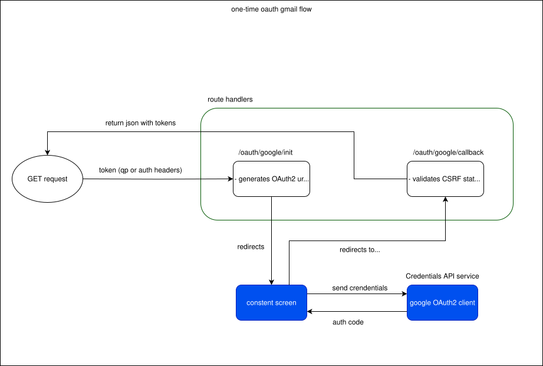

# Teleférico Bariloche 2024 — Web (Next.js)

Frontend application of the project, implemented with Next.js (App Router).

- Monorepo overview: [../README.md](../README.md)
- Infrastructure, CI/CD and GCP deployments: [../docs/INFRA.md](../docs/INFRA.md)
- This README: scripts, variables and frontend-specific flows

## Useful scripts

- `pnpm run dev`: Runs the development server at `http://localhost:3000`
- `pnpm run build`: Builds the app
- `pnpm start`: Starts the built app
- `pnpm run lint`: Lints the files
- `pnpm run typecheck`: Checks that files included in `tsconfig.json` comply with TypeScript rules
- `pnpm run test`: Runs the Vitest unit, component, guard, and Route Handler suite
- `pnpm run test:e2e:smoke`: Runs the local Chromium smoke suite with deterministic server-side CMS fixtures
- `pnpm run test:e2e:maintenance`: Runs the local Chromium maintenance-mode smoke suite
- `pnpm run test:e2e`: Runs both local E2E suites; Playwright starts or reuses the local fixture and Next.js servers
- `pnpm run test:e2e:production`: Runs the read-only public production smoke suite; requires `PUBLIC_E2E_BASE_URL`

## Browser E2E testing

Playwright is Chromium-only in the initial browser test layer. Its local fixtures run as a separate HTTP server and are supplied to the Next.js server through `BUILD_STRAPI_BASE_URL`; no test route or production-accessible bypass is added to the application.

Feedback pages, APIs, and dashboard navigation are closed unless the server-side `FEEDBACK_CAPABILITY_ENABLED` value is exactly `true`. The same explicit flag controls local, staging, and production; no runtime or deployment label overrides it. Playwright's fixture app process opts in explicitly. The flag is server-only and must never use a `NEXT_PUBLIC_` name. The documentary staging snapshot currently sets it to `true`, while production sets it to `false`; neither value proves what is deployed or that staging is ready. Any operator update to a live trigger remains separate and manual. A future, separately approved feature-completion change is required to make deployment defaults `true`.

Agents run `pnpm run test:e2e` while implementing or diagnosing browser behavior. Developers are not required to run E2E commands manually, and no pre-commit or pre-push hook runs the suite.

Playwright writes failure traces, screenshots, videos, and HTML reports to `test-results/` and `playwright-report/`. Both paths are ignored by Git.

See [../docs/playwright-e2e.md](../docs/playwright-e2e.md) for the pull-request, promotion, and production-smoke execution policy.

## Environment variables

The `.env.example` file documents each environment variable of the package.

### Current TB-113 process settings

The app process requires its Strapi origin, app-owned Custom Content API token, the shared report-generation profile, worker target, and queue settings. `FEEDBACK_CAPABILITY_ENABLED` is server-only and remains `false` in deployment defaults; local development may enable it for an authorized operator. `BUILD_STRAPI_BASE_URL` and `FEEDBACK_CMS_ALLOWED_ORIGIN` must identify the same exact Strapi origin.

Create a separate **Custom Content API token** in Strapi for the app. Enable exactly `feedbackAdminRead`, `workerSourceRead`, and `workerReportDownloadMetadata`. The worker has its own token and must never receive the app token; the app does not need the worker token.

| App-process setting | Purpose |
| --- | --- |
| `BUILD_STRAPI_BASE_URL` | Strapi base URL. |
| `FEEDBACK_CMS_ALLOWED_ORIGIN` | The single approved Strapi origin; must match the base URL. |
| `FEEDBACK_APP_CMS_TOKEN` | Plain app-owned Custom Content API token with exactly the three app permissions above. |
| `FEEDBACK_WORKER_URL` and `FEEDBACK_TASK_QUEUE_PATH` | Worker endpoint and task queue. Local development requires the exact loopback worker endpoint. |
| `FEEDBACK_WORKER_OIDC_AUDIENCE`, `FEEDBACK_TASK_INVOKER_EMAIL`, `FEEDBACK_WORKER_OIDC_PRINCIPAL` | Production task identity settings. |
| `FEEDBACK_VERTEX_PROJECT_ID`, `FEEDBACK_PRIVATE_BUCKET` | Approved Vertex project and private report bucket. |
| `FEEDBACK_WORKER_EVIDENCE_KEY` | Secret Manager resource name and pinned version in production, not key bytes. Development derives a synthetic-only key from approved nonsecret metadata and makes no Secret Manager call. |

Do not put any token or key bytes in documentation, browser code, the shared report profile, or shared client settings. The app token belongs only to the app process; configure the separate worker token in the worker process.

App, CMS, and worker load the same versioned nonsecret profile from `../packages/tb113-runtime-contracts/config/report-generation.json`. Do not copy it into `.env` files or override it through environment variables. The profile pins the approved model context-window budget (`1,048,576`) and standard non-global PayGo rates (`$1.65` input / `$8.25` output per million tokens), excluding promotional credits, caching, and contract discounts. Public sources: [Gemini 3.8 Flash model details](https://docs.cloud.google.com/gemini-enterprise-agent-platform/models/gemini/3-8-flash) and [Vertex AI pricing](https://cloud.google.com/vertex-ai/generative-ai/pricing). The existing planner reserves output tokens and derives safety headroom (`104,858` tokens); the context window is a planning budget, not a prompt allowance. These configured values do not verify live Google access. The profile owns source revision, evidence-key ID, and pricing version as code-release metadata; historical report runs keep their immutable persisted model and pricing snapshots. Increment `pricingSnapshot.version` when a verified price changes.

## TB-113 package boundaries

The app keeps browser-facing feedback routes, administration, task dispatch, and mediated report downloads. Pure reporting, TB-113 runtime contracts, and private report-storage adapters are shared from root `packages/` through the `@teleferico/*` TypeScript aliases. The private worker process is an independent root package at `../services/survey-report-worker`; it is not part of the public app runtime. `next.config.mjs` enables external source compilation for these repository packages. ECharts belongs to the worker package; the app keeps Recharts for its dashboard and its parity POC calls the worker's SVG renderer from test-only code under `tests/tb113/renderer-poc.ts`.

The app Dockerfile is built from the repository root so those shared sources are available at their existing paths. Its Dockerfile-specific ignore file allowlists only the app and those three packages, excluding local environment files, `.npmrc`, credentials, dependencies, generated output, and uploads. The build-only Strapi content token is consumed through a BuildKit secret mount and must not be passed as a build argument or persisted in the image. The Cloud Build YAML files are documentary snapshots; an operator must manually update the live inline trigger after review.

See [the worker package README](../services/survey-report-worker/README.md) for its local build, artifact contents, Node tests, and separate operational gates. Keeping this source layout does not create a Cloud Run service or deployment trigger.

---

## Flows

### Gmail OAuth setup (Gmail API via OAuth2)

This project can send emails from the contact form using Gmail API. For this, a one-time authorization is performed to obtain a `refresh_token` that is then saved as an environment variable.

Routes (Next.js App Router):

- `GET /api/oauth/google/init`: generates the consent URL and redirects. Protected with admin token.
- `GET /api/oauth/google/callback`: Google callback, exchanges the `code` for tokens and returns the `access_token` and `refresh_token`.

Flow:

1. An admin executes `/api/oauth/google/init` with the header `Authorization: Bearer <INIT_TOKEN>` or the query parameter `?token=<INIT_TOKEN>`.
2. The consent screen opens with `access_type=offline` and `prompt=consent` to obtain a `code`.
3. Google redirects to `/api/oauth/google/callback?code=...&state=...`.
4. If successful, the JSON response shows the `refresh_token`. Copy it to the environment variable `OAUTH_REFRESH_TOKEN` (do not commit).



Security notes:

- Scope is limited to `https://www.googleapis.com/auth/gmail.send`.
- Signed `state` (HMAC) and httpOnly cookie are used to prevent CSRF in the OAuth flow.
- The `init` endpoint requires `INIT_TOKEN` to prevent public usage.

Operational decision per environments:

- Currently `staging` and `production` share the same external integration for Gmail OAuth and reCAPTCHA.
- For this reason, the following secrets may have the same value in both environments:
  - `RECAPTCHA_SECRET_KEY`
  - `GOOGLE_CLIENT_ID`
  - `GOOGLE_CLIENT_SECRET`
  - `OAUTH_REFRESH_TOKEN`
- This is valid if both environments use the same authenticated Gmail account, the same Google OAuth Client and the same reCAPTCHA configuration.
- Tradeoff: simplifies operation, but reduces isolation between `staging` and `production`.
- Even sharing those values, the Google OAuth client must have authorized redirect URIs from both environments.

Middleware/i18n:

- The `middleware.ts` already excludes routes under `/api` in its `matcher`, so `/api/oauth/*` will not be affected by locale redirects.

How to execute the authorization once:

1. Start the app (`pnpm run dev`).
2. Open: `curl -i -H "Authorization: Bearer $INIT_TOKEN" http://localhost:3000/api/oauth/google/init`
3. Complete consent in Google.
4. In the redirect to `/api/oauth/google/callback` the `refresh_token` is returned (if it's the first time or with `prompt=consent`).
5. Copy `refresh_token`:
   - For local development paste the value in `.env.local`.

If Google does not return `refresh_token`:

- Make sure to use `prompt=consent` and that there is no previous grant. Revoke access in the Google account and retry.

---

## Endpoint and form security architecture

### Feedback report task identity

The server-side feedback dispatch seam derives queue names only from valid
report-run UUIDs: `tb113-report-<UUID without hyphens>`. Invalid CMS run
identifiers fail closed before dispatch. This deterministic identity is not a
browser contract or proof that a task was created. The app uses the same
`FeedbackCloudTaskClient` create/readback contract in production and local
development. Production remains pinned to Google Cloud Tasks REST and Cloud Run
keyless access tokens. With `NODE_ENV=development`, the client accepts only an
exact loopback worker URL from `FEEDBACK_WORKER_URL`, derives the local task API
from its port, and reads the queue from the existing `FEEDBACK_TASK_QUEUE_PATH`;
that path uses the server-only local task API credential and is unavailable for
non-loopback or production configuration. The worker's `pnpm dev` owns the
loopback queue and delivers task POSTs to the authenticated worker HTTP handler.
The queue is in-memory and L1 does not configure model dependencies, so this
boundary proves dispatch/readback/delivery only, not report generation or
persistent task state. The existing mediated download contract can read
digest-bound private PDFs from the shared repository-local
`.local/tb113-private-reports` directory in development; production continues to
read from private GCS. The worker's configured development runtime uses the same
file bucket, actual PDF renderer, and action-scoped Strapi client. Vertex
CountTokens and model generation use lazy local GoogleAuth ADC only after a
report is dispatched; separately authorize that live operation before using
credentials. Development derives a predictable synthetic evidence key from
approved nonsecret metadata and makes no Secret Manager call. That key is not
production security evidence and must be limited to synthetic local data. The
CMS reservation/outcome contract and existing coordinator semantics are
unchanged.

For local TB-113 development, `BUILD_STRAPI_BASE_URL` and
`FEEDBACK_CMS_ALLOWED_ORIGIN` may both name the same exact Strapi origin using
`http://127.0.0.1:<port>` or `http://localhost:<port>` only while
`NODE_ENV=development`. The server-side feedback transports keep their existing
action-scoped CMS tokens and admin session/CSRF checks. Other private-network
addresses and mismatched host/port pairs are rejected;
non-development runtimes continue to require the exact allowlisted public HTTPS
origin. Start Strapi with either `HOST=127.0.0.1 npm run develop` or
`HOST=localhost npm run develop` from `teleferico-cms`; `HOST` controls Strapi's
HTTP bind address and does not change the independently configured database
host. Keep the app on its ordinary `pnpm dev` command.

### Full local TB-113 report flow

The dashboard uses the ordinary authenticated routes and `pnpm run dev`; it
does not have a preview mode or a report-response fixture. To run it against
persistent local data, set `BUILD_STRAPI_BASE_URL` and
`FEEDBACK_CMS_ALLOWED_ORIGIN` to the same exact CMS origin (`127.0.0.1` or
`localhost`) including its port. The worker URL and local queue remain bound to
`127.0.0.1`:

1. Start local PostgreSQL, then run `HOST=localhost npm run develop` (or
   `HOST=127.0.0.1 npm run develop`) from `teleferico-cms`
   using its existing local database configuration. In a second CMS terminal, run
   `NODE_ENV=development node scripts/seed-surveys.js --local-feedback` from
   `teleferico-cms`. This adds only the marker-owned synthetic survey and
   submissions; cleanup is
   `NODE_ENV=development node scripts/seed-surveys.js --cleanup-local-feedback`.
  2. Configure the existing TB-113 CMS origin, app-owned `FEEDBACK_APP_CMS_TOKEN`, worker-owned `FEEDBACK_WORKER_CMS_TOKEN`, and worker URL/queue settings in the local app/CMS/worker configuration. The shared profile already contains the approved context budget and standard non-global rates; this does not prove live Google access. Separately authorize the destination, operation, and credential/session before exercising live Vertex. Do not copy token values into documentation or browser code.
   Keep the worker URL on `http://127.0.0.1:<port>` and use the existing queue
   path setting; `pnpm dev` owns both worker and queue listeners.
3. For an authorized local operator, the existing server-only
   `FEEDBACK_CAPABILITY_ENABLED` can be set to `true` in the local app runtime;
   deployment defaults stay `false`. This flag does not grant user capabilities.
   Normal Auth.js sessions derive exactly four feedback capabilities from the
   currently verified CMS role: `Administrator` and `Digital Experience
   Operator` receive the bundle; other, missing, or blocked users receive none.
   Their required Strapi native actions and the app's separate custom tokens
   remain independent permission gates; this repository provisions no grants.
4. In separate terminals, run `pnpm dev` from `services/survey-report-worker`
   and then `pnpm dev` from `teleferico-app`. The dashboard uses ordinary
   authenticated routes and the existing mediated download handler.

The opt-in real-browser integration is isolated from default E2E/CI discovery:

```bash
COREPACK_ENABLE_NETWORK=0 pnpm exec playwright test --config playwright.local-feedback.config.ts
```

It provisions its own PostgreSQL/Strapi database, synthetic user and scoped
tokens, local queue/worker, and private PDF directory; it replaces only external
Google provider responses. Browser feedback routes are not stubbed. The runner
starts the ordinary `pnpm dev` script from a temporary app root containing the
same app source and an explicit config whitelist; it excludes repository/user
`.env*` and `.npmrc` files and supplies only synthetic runtime settings. It cleans
only resources carrying its generated test owner. The normal `pnpm dev`
worker uses lazy ADC only for Vertex. Development derives a synthetic local
evidence key and does not call Secret Manager; real Vertex access is not
exercised by this test and requires separate authorization.

The one browser scenario logs in through Strapi/Auth.js as a synthetic
`Digital Experience Operator`, verifies the four server-issued capabilities
and JWT non-exposure, checks missing-CSRF and untrusted-origin requests are
rejected, generates through the real app route, waits for persisted `succeeded`
history, and downloads the worker PDF through the authenticated app fetch. It
checks the PDF signature, end marker, and SHA-256 against the route's ETag.

The normal worker calls the configured Vertex and Secret Manager providers
through lazy local ADC when a report is requested. That live operation is not
verified by local unit tests and requires separate authorization for its
destination, operation, and credential/session. Automated local integration
tests must use an isolated PostgreSQL/Strapi/Next/worker stack and replace only
external Google provider responses; CMS persistence, worker HTTP/render/storage,
and authenticated app routes remain real. The default Playwright
`feedback-admin.spec.ts` still uses fixture-backed feedback APIs; only the
separate local-feedback config runs the persistent full journey.

Below describes how the **security architecture** is designed around:

- public forms (like contact and applications),
- the **API Proxy** to Strapi,
- and the **administrative endpoints** consumed from the dashboard.

The goal is to understand:

- What types of endpoints exist.
- What problems each layer tries to solve (external origins, form abuse, CSRF, unauthorized consumption of internal endpoints, etc.).
- How they combine: origin, internal API key, Auth.js session, CSRF token, rate limit, honeypot, validations, proxy, etc.

### Endpoint types and security model

Conceptually, the Next.js backend exposes four main types of endpoints:

1. **Public read-only endpoints**

Routes:

- `GET /api/proxy/[...endpoint]` (when used only for reading).
- `GET /api/proxy-files/[...endpoint]` (when used only for reading).

Characteristics:

- Publicly accessible.
- Only perform read operations (GET).
- Do not modify state in Strapi or other services.
- Used to feed the institutional part.

Main security layers:

- `ensureTrustedOrigin` to limit requests from browsers to trusted origins.
- Soft rate limit to prevent excessive abuse/scraping.
- Do not require session or internal API key.

2. **Internal server-to-server endpoints**

   Routes:
   - `/api/contact`
   - `/api/postulations`
   - Other internal endpoints that should only be called by Server Actions / internal services.

   Characteristics:
   - Not consumed directly from the browser.
   - The public frontend triggers **Server Actions**, which in turn call these endpoints from the server.
   - Use an **internal API key** (`x-internal-api-key`) that is never exposed to the client.

   Main security layers:
   - `requireInternalApiKey(req)`:
     - Verifies that the header `x-internal-api-key` matches the environment variable `INTERNAL_API_KEY`.
     - Ensures only the own backend (Server Actions/services) can invoke the endpoint.

   - `ensureTrustedOrigin` (as additional defense for requests coming from browser or reused patterns).
   - Aggressive rate limit by IP.
   - Body size limit (to avoid huge payloads).
   - Honeypot, minimum/maximum form age.
   - Schema validation (Yup).
   - Server-side verified reCAPTCHA.

3. **Administrative endpoints**

   Routes:
   - `/api/admin/postulations/[id]/favorite`
   - `/api/admin/postulations/bulk-status`
   - Any endpoint that operates on the administrative part `/api/admin/*` and is consumed exclusively from the dashboard.

   Characteristics:
   - Only accessible for authenticated users in the dashboard.
   - Potentially expose **CRUD** operations. Currently defined endpoints only operate with the `update` permission of Strapi's role interface.
   - Consumed from the dashboard client, but always with Auth.js session and a CSRF token.

   Main security layers:
   - **Auth.js session (`auth()`)**:
     - Verification that the user has a valid session.
     - Role/permission information available in the token/session.

   - **CSRF token**:
     - Generated in Auth.js's `jwt` callback and stored in the JWT.
     - Exposed in the Auth.js `session` as `session.csrfToken`.
     - Published in the dashboard pages' `<head>` via `generateMetadata` as:

       ```html
       <meta name="csrf-token" content="..." />
       ```

     - Read on the client and sent in a `x-csrf-token` header in each mutating request from the dashboard through the `authenticatedInternalApiFetch` function.
     - Verified in a helper like `requireCsrf(req)` that compares the header with `session.csrfToken`.

   - `ensureTrustedOrigin`:
     - To ensure mutating requests come from the dashboard itself and not from external sites.

   - Rate limit (optional) for sensitive operations.

4. **Infrastructure / specific configuration endpoints**

   These are endpoints that are not part of the normal application flow for end users, but are necessary to integrate authentication services and external APIs.

   Examples:
   - **Auth.js endpoint**  
     Auth.js route (e.g., `/api/auth/[...nextauth]`), used internally by the library for:
       - handling login/logout flow,
       - resolving login/logout redirects from the dashboard with `NEXT_PUBLIC_SITE_URL` to not depend on internal host,
       - emitting and refreshing the session cookie,
       - resolving Auth.js own callbacks.
       Characteristics:
     - Does not contain project business logic.
     - Its security (httpOnly cookies, JWT signing, internal CSRF protection for its own routes, etc.) is managed by Auth.js.
     - It is invoked as part of the authentication flow, but not consumed directly from business code (forms, proxy, dashboard, etc.).

   - **Gmail OAuth endpoints (one-time setup)**  
     Routes under `/api/oauth/google/*` (`/init` and `/callback`) used to complete **a single time** the OAuth2 flow with Gmail and obtain the `refresh_token` needed to use `gmail.send` in the contact form.  
     Characteristics:
     - Executed only in configuration scenarios (e.g., when preparing a new environment or updating credentials).
     - Protected via:
       - an `INIT_TOKEN` (admin token) for the `init` endpoint,
       - signed `state` and httpOnly cookie in the callback to prevent CSRF in the OAuth flow,
       - scope limited to `https://www.googleapis.com/auth/gmail.send`.
     - Once the `refresh_token` is obtained and saved in environment variables, these endpoints are not used in the normal application flow.

- Which endpoints should be anonymously accessible and only read data.
- Which should only be accessible "from inside" (server-to-server).
- Which represent administrative actions and require session + CSRF.

---

## Key concepts

- **Same-Origin Policy / CORS**
  Protects browsers from cross-origin requests; does not protect against scripts or backends (server-to-server).

- **Browser vs non-browser clients**
  - The browser adds headers like `Origin`, `Referer`, `sec-fetch-site` and applies CORS.
  - A backend/shell (curl, Node, etc.) can send any header and does not respect CORS.

- **Request origin**
  Reconstructed with:
  - `Origin`,
  - `Referer`,
  - or `x-forwarded-proto` + (`x-forwarded-host` or `host`).

- **Internal API key (`x-internal-api-key`)**
  Header set via the environment variable `INTERNAL_API_KEY`, and can only be consumed from the server side (Server Actions or services).
  Used to mark endpoints that **should not be called directly from the browser** (type 2: server-to-server).

- **ensureTrustedOrigin**
  Central helper that combines:
  - origin extraction,
  - building `allowedOrigins` (from `NEXT_PUBLIC_SITE_URL` and extra origins),
  - and the decision to allow or reject the request with a `403`.

- **Auth.js session + CSRF token (admin endpoints)**
  - Auth.js manages the httpOnly session cookie and internal JWT.
  - In the `jwt` callback a random `csrfToken` is generated and stored in the token.
  - In the `session` callback that `csrfToken` is exposed as `session.csrfToken`.
  - The dashboard segment uses `generateMetadata` to inject:

    ```ts
    other: { "csrf-token": session.csrfToken }
    ```

  - A client helper (e.g. `authenticatedInternalApiFetch`) reads `<meta name="csrf-token">` and sends `x-csrf-token`.
  - A server helper (`requireCsrf(req)`) compares `x-csrf-token` with the value of `session.csrfToken`.

- **Guard orchestrator (`runFormGuards` + `withFormGuards`)**
  Primarily intended for public forms (type 2), groups several validations before reaching business logic.

---

## Available security layers

These layers can be applied:

- directly in a Route Handler, or
- centrally through `runFormGuards` / `withFormGuards` (for public forms).

Layers:

- **Origin validation** (all types where it makes sense)
  - `ensureTrustedOrigin(req, allowedOrigins?)`
  - Verifies that the calculated origin is in the set of allowed origins (by default includes `NEXT_PUBLIC_SITE_URL`).
  - Used:
    - In read-only endpoints (type 1) to filter requests from browser.
    - In server-to-server endpoints (type 2) as additional defense.
    - In admin endpoints (type 3), along with CSRF token, to reinforce protection against CSRF/cross-site.

- **Internal API key** (only type 2)
  - Validated with `requireInternalApiKey(req)`.
  - Marks endpoints that should only be consumed from Server Actions / internal services.

- **Rate limit by IP**
  - `getClientIp(req)` + `isRateLimited(ip, store, maxHits, windowMs)`.
  - Prevents abuse of public forms from the same IP and can also be applied in read-only and admin endpoints.

- **Body size limit**
  - `checkContentLength(req, maxBodyBytes)`.
  - Blocks too large payloads without needing to parse the entire body.

- **Honeypot** (mainly type 2)
  - Hidden field in the form (`honeypot`).
  - If it comes with content, it's assumed to be a bot and responds "as if" it were successful without revealing the trick.

- **Form age (`formLoadedAt`)** (type 2)
  - `validateFormAge(formLoadedAt, { minAgeMs, maxAgeMs })`.
  - Filters submissions that are too fast (likely bot) or too old.

- **Schema validation (Yup)**
  - `buildContactSchema`, `buildPostulationSchema`, etc.
  - Ensure valid types and ranges before touching external services (Gmail, Strapi).

- **Captcha (reCAPTCHA)**
  - `verifyCaptchaToken` in Server Actions.
  - Prevents mass automation from bots in public forms.

- **CSRF token (only admin endpoints, type 3)**
  - Verified on the server comparing `x-csrf-token` with `session.csrfToken`.
  - Complemented with `ensureTrustedOrigin`.

---

## Origin helpers: ensureTrustedOrigin

All origin logic is centralized in `ensureTrustedOrigin` (in `lib/http/origin.ts`).

### ensureTrustedOrigin(req, allowedOrigins?)

Simplified signature:

- `ensureTrustedOrigin(req: NextRequest, allowedOrigins?: Set<string>)`
  returns:
  - `{ ok: true; origin: string }` if the origin is valid.
  - `{ ok: false; res: NextResponse<{ ok: false; message: string }> }` if it should be blocked (403).

Typical usage in a route handler:

```ts
const result = ensureTrustedOrigin(req);
if (!result.ok) return result.res;

// trusted origin available:
const origin = result.origin;
```

If `allowedOrigins` is not passed, the function builds a default set from:

- `NEXT_PUBLIC_SITE_URL` (without trailing `/`),
- and optionally extra origins added via `buildAllowedOrigins`.

Internal logic (summary):

1. `extractOrigin(req)`:
   - Tries to read `Origin`.
   - If not present, tries `Referer`.
   - If not present, reconstructs with `x-forwarded-proto` + (`x-forwarded-host` or `host`).

2. `buildAllowedOrigins()`:
   - Creates a `Set<string>` with:
     - normalized `NEXT_PUBLIC_SITE_URL`,
     - and extra origins if passed.

3. `isOriginAllowed(origin, allowedOrigins)`:
   - If the set is empty → everything allowed.
   - If there's no `origin` → blocks.
   - If `origin` is not in the set → blocks.

4. If the origin is not valid:
   - returns `{ ok: false, res: NextResponse.json({ ok: false, message: "Forbidden" }, { status: 403 }) }`.

5. If valid:
   - returns `{ ok: true, origin }`.

### Development notes (origins on local network)

In development, Next.js usually exposes two URLs:

- `http://localhost:3000`
- `http://<local-network-ip>:3000` (to access from other devices on the LAN, like a cell phone)

Since `ensureTrustedOrigin` validates the `origin` against a set of allowed origins, a special rule was added to avoid having to update the `.env` every time the local network IP changes:

- In **production**, only origins that are in `allowedOrigins` are accepted (for example, `NEXT_PUBLIC_SITE_URL`).
- In **development**, besides `allowedOrigins`, `ensureTrustedOrigin` accepts any `origin` whose hostname belongs to a private network (`localhost`, `127.0.0.1`, `10.x.x.x`, `172.16-31.x.x`, `192.168.x.x`).

This allows:

- Entering with `http://localhost:3000` from the same machine.
- Entering with `http://192.168.x.x:3000` (or `http://10.x.x.x:3000`) from a cell phone or another device on the LAN.

Production logic remains strict and is not affected by this relaxation for development environments.

---

## runFormGuards and withFormGuards (public forms – type 2)

For public forms, a security orchestrator is used:

- `runFormGuards(req, options)`:
  - Validates internal API key (if configured).
  - Calls `ensureTrustedOrigin(req, allowedOrigins)`.
  - Applies body size limits.
  - Applies rate limit by IP.
  - Returns:
    - `{ ok: false, res: NextResponse }` if any validation fails.
    - `{ ok: true }` if everything is OK.

- `withFormGuards(options, handler)`:
  - Wraps your business handler:
    - Executes `runFormGuards`.
    - If something fails returns the error `NextResponse`.
    - If everything passes executes `handler(...)`.

The advantage of this approach is that **all public form routes share the same security layer**, leaving each handler only its specific form logic.

---

## Public form flow (type 2)

Generic example (contact / application):

1. The user completes the form in the browser.

2. The submit calls a **Server Action** (`contactUsAction`, `sendPostulationAction`, etc.).

3. The Server Action:
   - Verifies reCAPTCHA.
   - Builds a typed payload (form data).
   - Adds security fields (`honeypot`, `formLoadedAt`, etc.).
   - Calls a **server-side service** (`sendEmail`, `sendPostulation`, etc.).

4. The service:
   - Builds the internal Route Handler URL (`APP_INTERNAL_BASE_URL + ROUTE_HANDLERS.X`).
   - Adapts the payload to JSON or `FormData`.
   - Sets headers:
      - `Origin: NEXT_PUBLIC_SITE_URL` (for `ensureTrustedOrigin`).
     - `x-internal-api-key: INTERNAL_API_KEY` (for `requireInternalApiKey`).

   - Makes `fetch` to the Route Handler with timeout.

5. The Route Handler:
   - Is wrapped with `withFormGuards` (uses `runFormGuards` internally).
   - Validates API key, origin, rate limit, body size, etc.
   - If everything is valid, executes the real form handler:
     - Reads the body.
     - Validates honeypot.
     - Validates form age.
     - Validates with Yup.
     - Calls external services (Gmail, Strapi Upload, record creation).
     - Returns consistent JSON to the frontend.

---

## API Proxy to Strapi (`/api/proxy` + useProxy)

### Objective

Expose an internal Next API (`/api/proxy`) that:

- is the **only access point** to Strapi from the client,
- hides the real Strapi URL,
- manages the session JWT on the server (not in the browser).

### Architecture

- The client **does not call Strapi directly**.
- Instead, it uses a custom hook `useProxy` (or a `fetch` to `/api/proxy/...`) to request resources.
- The Route Handler `/api/proxy`:
  - Is considered, in practice, a **public read-only endpoint (type 1)** when limited to GET.
  - Calls `ensureTrustedOrigin(req)` at the start:
    - if the request does not come from an allowed origin, returns 403.

  - Reconstructs the Strapi URL: `BUILD_STRAPI_BASE_URL + endpointPath + query params` from `[...endpoint]` and `searchParams`.
  - Classifies the requested endpoint before sending credentials to Strapi:
    - public read endpoints (`activities`, `bus-trips`, `component-translations`, `faqs`, `news`, `service-state`, `tickets`, `zones`) use `BUILD_STRAPI_CONTENT_TOKEN` from the server;
    - private endpoints (`postulations`) require session and use `Authorization: Bearer <session.jwt>`;
    - private endpoints without session return 401 and never fall back to the public token.
  - Makes `fetch` to Strapi from the backend.
  - Returns Strapi's JSON (and the corresponding `status`) to the client.

### Benefits

- The client never sees the **Strapi URL** or the **JWT**.
- Strapi infrastructure can be changed (host, proxies, etc.) without touching the client.
- The same trusted origin logic (`ensureTrustedOrigin`) is reused as in public forms and admin endpoints, maintaining consistent security criteria across all sensitive Route Handlers.

---

## Static locale generation

The segment `src/app/[locale]` defines `generateStaticParams()` and `dynamicParams` based on the environment variable `ENABLE_STATIC_LOCALE_PARAMS`.

- `ENABLE_STATIC_LOCALE_PARAMS=true`: `generateStaticParams()` returns `i18n.locales`, `dynamicParams` is set to `false` and Next.js only accepts known/pre-generated locales.
- Any other value, or missing variable: `generateStaticParams()` returns `[]`, `dynamicParams` is set to `true` and locale routes are resolved dynamically on demand.

This toggle is evaluated during build/deploy; changing it in an environment requires rebuilding/redeploying the application to modify the generated behavior.

---

## Local development (quick)

1. Make sure the CMS is running at `http://localhost:1337` (Strapi).

2. Create `./teleferico-app/.env.local` with the environment variables detailed in the file `./teleferico-app/.env.example`, for example:

```env
BUILD_STRAPI_BASE_URL=http://localhost:1337
BUILD_STRAPI_BUCKET_HOSTNAME=localhost
BUILD_STRAPI_BUCKET_PATHNAME=/uploads/*
NEXT_PUBLIC_SITE_URL=http://localhost:3000
APP_INTERNAL_BASE_URL=http://localhost:3000
ENABLE_STATIC_LOCALE_PARAMS=false
```

3. Execute:

```bash
pnpm run dev
```
